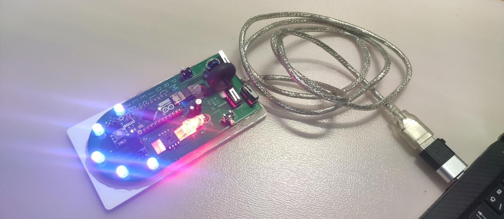
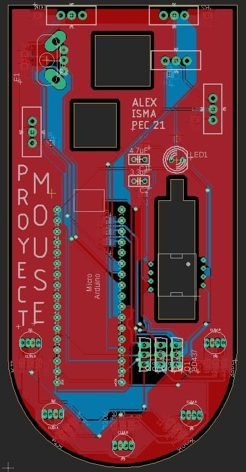
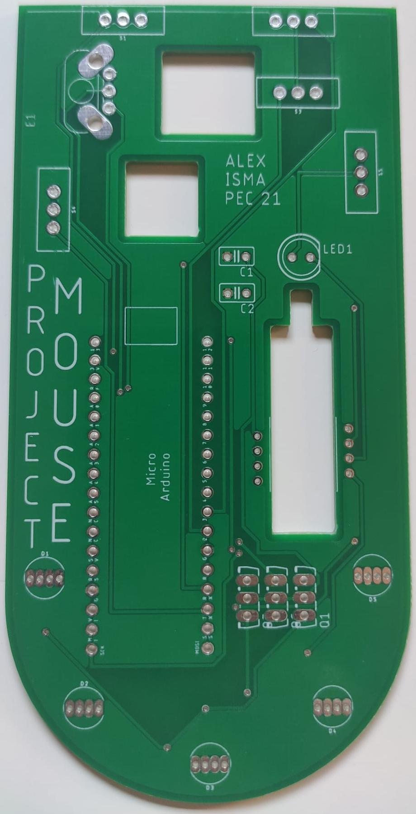
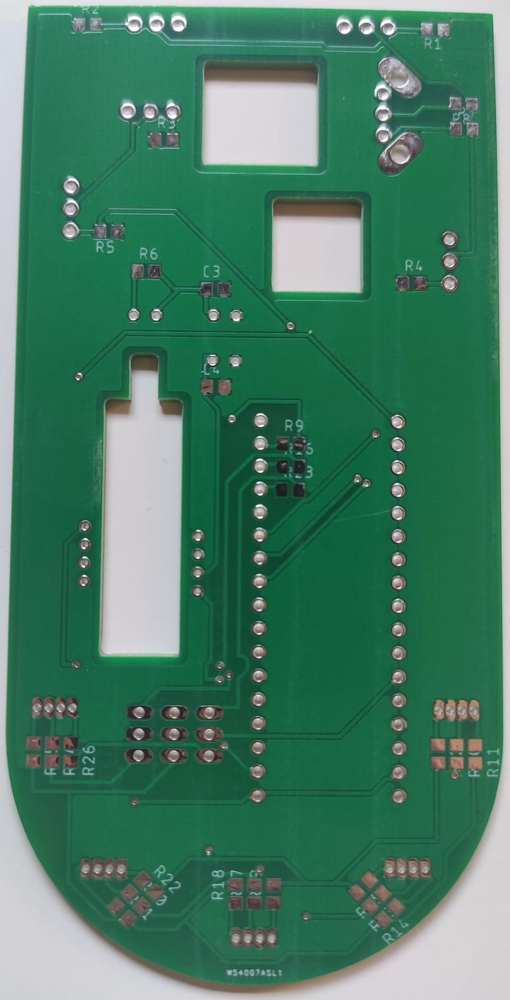

# `Mouse`

This repository contains the firmware for a custom gaming computer mouse with cool RGB LEDS and dynamic DPI configuration.
As a bonus, there is also the firmware and desktop software in order to see what is the optical sensor (ADNS5050) actually seeing through its 19p camera.

**`PEC-FIB mouse project`**

# Screenshots

### Mouse

### PCB Design

### PCB Top

### PCB Bottom

# Credits

- [**`Alex Rodriguez`**](https://github.com/neoxelox)
- [**`Isma Quiñones`**](https://github.com/ismaqg)

# Setup

For both firmwares the `PlatformIO` VSCode extension is required in order to flash the Arduino Micros.

For the camera desktop software the Python packages needed are listed in the `requirements.txt` file.
